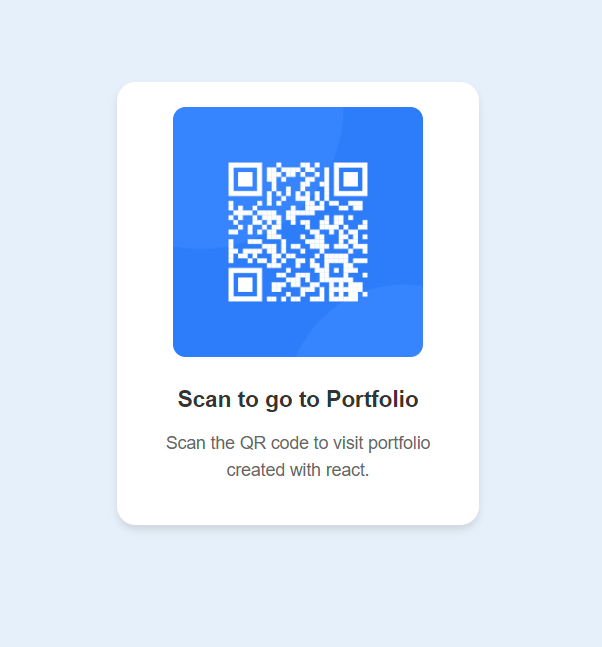

# QR Code Card Project

A visually appealing QR code card built using HTML and CSS, designed to improve front-end development skills while practicing clean, minimalistic design principles.
## Table of contents

- [Overview](#overview)
  - [Screenshot](#screenshot)
  - [Links](#links)
- [My process](#my-process)
  - [Built with](#built-with)
  - [What I learned](#what-i-learned)
  - [Continued development](#continued-development)
  - [Useful resources](#useful-resources)
- [Author](#author)
- [Acknowledgments](#acknowledgments)


## Overview

### Screenshot



### Links

- Solution URL: [url will be added here](https://your-solution-url.com)
- Live Site URL: live site here](https://your-live-site-url.com)

## My process

### Built with

- Semantic HTML5 markup
- CSS custom properties
- Flexbox
- CSS Grid
- Mobile-first workflow
- [React](https://reactjs.org/) - JS library
- [Next.js](https://nextjs.org/) - React framework
- [Styled Components](https://styled-components.com/) - For styles

**Note: These are just examples. Delete this note and replace the list above with your own choices**

### 🌟 What I Learned

Through this project, I enhanced my understanding of **HTML and CSS** by designing a visually appealing and responsive card layout. I learned to use **flexbox** for layout alignment and applied custom **CSS properties** like `box-shadow`, `border-radius`, and `hover effects` to improve the UI/UX. Additionally, I explored how to embed and style **QR codes** effectively, ensuring a seamless user interface. This project also helped me practice writing clean and modular code, improving my front-end development skills. By researching and using design inspiration from tools like **Frontend Mentor**, I gained insight into creating professional-looking layouts while refining my knowledge of design principles.


To see how you can add code snippets, see below:

```html
<h1>Some HTML code I'm proud of</h1>
```
```css
.proud-of-this-css {
  color: papayawhip;
}
```
```js
const proudOfThisFunc = () => {
  console.log('🎉')
}
```

If you want more help with writing markdown, we'd recommend checking out [The Markdown Guide](https://www.markdownguide.org/) to learn more.


### Continued development

Use this section to outline areas that you want to continue focusing on in future projects. These could be concepts you're still not completely comfortable with or techniques you found useful that you want to refine and perfect.


### Useful resources

# 📚 Useful Resources

Here’s a collection of resources that helped me while working on this project and can help you as well:

---

### **HTML & CSS Fundamentals**
- [MDN Web Docs - HTML](https://developer.mozilla.org/en-US/docs/Web/HTML)  
  Comprehensive guide to HTML elements and attributes.

- [MDN Web Docs - CSS](https://developer.mozilla.org/en-US/docs/Web/CSS)  
  In-depth CSS documentation with examples.

- [CSS Tricks](https://css-tricks.com/)  
  Tutorials, tips, and tricks for mastering CSS.

- [W3Schools](https://www.w3schools.com/html/default.asp)  
  Beginner-friendly tutorials for HTML and CSS.

---

### **Design Tools**
- [Figma](https://www.figma.com/)  
  Free UI/UX design tool to create mockups and layouts.

- [Canva](https://www.canva.com/)  
  Easy-to-use design tool for backgrounds and visuals.

- [Coolors](https://coolors.co/)  
  Generate beautiful color palettes.

- [Google Fonts](https://fonts.google.com/)  
  Free fonts to enhance your typography.

---

### **Free QR Code Generators**
- [QR Code Monkey](https://www.qrcode-monkey.com/)  
  Free QR code generator with customization options.

- [QRStuff](https://www.qrstuff.com/)  
  Generate QR codes for different resources.

- [GoQR](https://goqr.me/)  
  A simple and fast QR code generator.

---

### **Frontend Challenges**
- [Frontend Mentor](https://www.frontendmentor.io/)  
  Practice front-end development with real-world projects.

- [Codewell](https://www.codewell.cc/)  
  Access free and premium UI design challenges.

- [DevChallenges](https://devchallenges.io/)  
  Solve real-life challenges to improve your web development skills.

---

### **CSS Libraries & Frameworks**
- [Tailwind CSS](https://tailwindcss.com/)  
  A utility-first CSS framework for fast styling.

- [Bootstrap](https://getbootstrap.com/)  
  Popular CSS framework for responsive design.

- [Animate.css](https://animate.style/)  
  Predefined CSS animations for web elements.

---

### **Learning Platforms**
- [FreeCodeCamp](https://www.freecodecamp.org/)  
  Interactive lessons on HTML, CSS, and web development.

- [The Odin Project](https://www.theodinproject.com/)  
  Full-stack development curriculum.

- [Scrimba](https://scrimba.com/)  
  Interactive tutorials for learning front-end development.

---

### **Inspiration & Community**
- [Dribbble](https://dribbble.com/)  
  Design inspiration for layouts and UI.

- [Behance](https://www.behance.net/)  
  Explore creative projects and ideas.

- [CodePen](https://codepen.io/)  
  Browse and share interactive front-end projects.

---

### **Tools for Debugging & Validation**
- [HTML Validator](https://validator.w3.org/)  
  Validate your HTML for errors.

- [CSS Validator](https://jigsaw.w3.org/css-validator/)  
  Check your CSS for issues.

- [DevTools](https://developer.chrome.com/docs/devtools/)  
  Built-in browser tools for debugging.

---

### **Next Steps**
- [Learn JavaScript](https://javascript.info/)  
  Enhance interactivity in your projects.

- [GitHub Docs](https://docs.github.com/)  
  Learn how to manage repositories.

- [Netlify](https://www.netlify.com/)  
  Free hosting to deploy and showcase your projects.

---


## Author

- Website - [alan chris disilva](https://github.com/alan61503)


## Acknowledgments

thanks to front end mentor for this prooject

